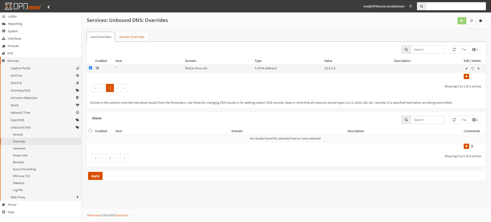

# tCache

Caching HTTP traffic, while transparently proxying it to the real server.
HTTPS traffic will just be redirected to the real server.


## Requirements

 - NGINX
   - stream module
   - steam_ssl module
   - steam_ssl_preread module
   - http_ssl_module
   - http_gzip_static_module

## Configuration

```shell
./configure \
    --prefix=/usr/local/nginx \
    --sbin-path=/usr/sbin/nginx \
    --conf-path=/etc/nginx/nginx.conf \
    --pid-path=/var/run/nginx/nginx.pid \
    --lock-path=/var/lock/nginx.lock \
    --error-log-path=/var/log/nginx/error.log \
    --http-log-path=/var/log/nginx/access.log \
    --with-http_gzip_static_module \
    --with-http_ssl_module \
    --with-stream \
    --with-stream_ssl_module \
    --with-stream_ssl_preread_module \
    --with-threads
```

## Usage

After configuring your NGINX server, using the [nginx.conf](nginx.conf) file, you need to point your DNS resolver to the IP address of your NGINX server.

Example:

